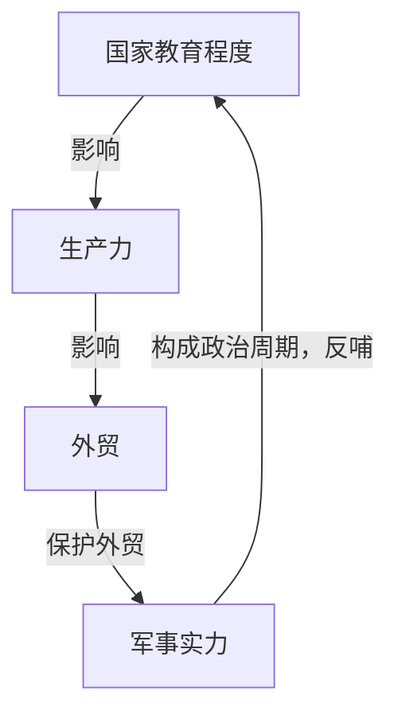

# 原则：应对变化中的世界秩序 D5;F112

> 原则.应对变化中的世界秩序.[美]瑞·达利欧;崔苹苹,刘波译.2022-中信出版社

# ❦ 引言

**一个政治周期**



**本书目的**
- 通过研究历史周期（如和平与混乱、债务周期等）及其背后的因果机制，识别当前事件在历史中的位置，并据此预测未来趋势和制定应对策略的宏观分析方法。
- 提出事件与事件之间的相关性

```
我们就像蚂蚁一样，在短暂的一生中全神贯注于搬运面包屑，却无暇拓宽视野，发现事物发展的宏观规律和周期及其背后的重要关联、我们在周期中所处的位置，以及未来可能出现的情况。
```

<details><summary>为什么有人愿意持有 <strong>负利率债券</strong> ？</summary> 
	<table>
  <tr>
    <th>原因类别</th>
    <th>具体解释</th>
  </tr>
  <tr>
    <td><strong>避险需求</strong></td>
    <td>对于投资者来说，负利率债券可能是动荡时期最“安全”的避风港，尤其是当其他资产（如股票、房地产、甚至银行存款）面临更大风险（如贬值、违约或政治不稳定）时。例如欧元区或日本的债券，尽管利率为负，但在危机中仍被视为“最不坏”的选择。</td>
  </tr>
  <tr>
    <td><strong>流动性需求</strong></td>
    <td>某些负利率债券市场流动性极高，如德国国债。投资者可能出于交易或抵押需要而持有，即使回报为负，也便于快速买卖或作为融资工具。</td>
  </tr>
  <tr>
    <td><strong>资本管制和政治风险</strong></td>
    <td>有些国家实行资本管制，或存在政治风险（如货币贬值或外币不可兑换），为了避免本国货币暴跌或资金被困，投资者更倾向持有发达国家的负利率债券作为“价值稳定”的替代品。</td>
  </tr>
  <tr>
    <td><strong>通胀预期与实际回报</strong></td>
    <td>某些负的<strong>名义利率（Nominal Rate）</strong> 并不意味着负的实际回报，尤其是在<strong>通货紧缩环境下</strong>：若通缩导致物价下降，名义负利率债券可能仍具正的实际回报。</td>
  </tr>
  <tr>
    <td><strong>央行干预与货币政策操作</strong></td>
    <td>大型金融机构和银行因央行的非常规货币政策（如负利率政策，NIRP）必须持有这些债券，否则可能会在政策利率体系中受到惩罚。此外，在量化宽松下，央行购债推高债券价格，投资者预期未来卖出时有资本利得。</td>
  </tr>
  <tr>
    <td><strong>机构投资人等法律义务</strong></td>
    <td>某些投资者（如保险公司、养老基金）出于监管要求或自身模型设定，必须持有一定比例的债券，不受利率高低影响。</td>
  </tr>
  <tr>
    <td><strong>货币贬值预期下的相对优势</strong></td>
    <td>若投资者认为其本币将对债券计价货币（如欧元或日元）大幅贬值，则即使债券利率为负，总体上仍有可能获得本币计价的正收益。</td>
  </tr></table></details>

```
如果等到学至自己很满意的程度才肯采取行动或进行分享，我就永远无法运用和传述所学到的东西。
```


# Ⅰ. 世界是如何运转的

## 1. 大周期简述

- 本章主要讲述 *世界运转的宏观机制* 。

### ⊿ [[财富-权力循环理论]]

```
古往今来，所有国家的财富拥有者都具备创造财富的手段。为了维持和增加财富，他们与政权掌控者合作，一起建立共生关系，制定和执行规则。我看到类似的情况发生在不同国家和不同时期。虽然具体形式已经演变，并将继续演变，但最重要的机制基本上没有改变。那些拥有财权的群体发生了演变，但其仍然以基本相同的方式合作和竞争。
```

### ⊿ 对大周期的理解

```
目前，相对财富、权力和世界秩序正在发生典型的巨变
```

达利欧找到了 18 个重要的决定性因素，用来解释几乎所有导致国家兴衰的长期质变。

这些变化发生在典型的大周期中，包括 3 个最重要的周期。
```
1. 长期债务和资本市场周期
2. 内部秩序和混乱周期
3. 外部秩序和混乱周期
```
在这些周期的驱动下，国家在两个极端之间（如和平与战争、繁荣与萧条等）更迭。
#### ⋗ **现实社会中的“钟摆现象”**
- 人们倾向于极端化，从而超过平衡点，出现过度而反向走势。
- 朝着一个方向的走势中，潜藏着导致反向走势的要素。


### ⊿ 进化、周期和颠簸

我们很难注意到身边发生着的变化，要想看到它们，必须设计出测量事物的方法，观察测量数据的变化，研究变迁背后的发生机制，找出应对变迁的方法。

- **进化**表现为知识积累带来的相对平缓而稳定的进步
- **周期**是来回波动的，朝着一个方向走到尽头后会逆转，类似钟摆的周而往复

进化与周期共同构成了事物发展的螺旋式上升轨迹。

#### ⋗ **生产率增速差异**
- 人类生产率的持续提升（人均产出增长）是世界财富、权力和生活水平提高的核心驱动力，其动力来源于知识积累、技术创新和技能改进。
- 但不同国家/群体的生产率增速，是有差异的。
- 增速差异总是归因于四大关键因素：
	- **教育质量**：人力资本的培养效率；
	- **创造力与创新**：发明和解决问题的能力；
	- **职业道德**：劳动参与率和工作效率；
	- **经济体制**：市场机制、产权保护等制度能否有效转化创意为产出。

#### ⋗ **知识积累**
- 与其他物种不同，人类的进化不仅依赖生物遗传，更依赖**知识积累和技术进步**。
- 我们的大脑赋予我们：
	- **学习和抽象思考能力** → 能理解复杂概念、建立理论、预测未来；
	- **技术发明与改进能力** → 不断优化工具、方法和社会结构；
	- **集体知识传承** → 通过语言、文字、教育体系实现跨代际智慧传递。
- 这使得人类的进化速度远超生物进化，形成**“认知—技术—社会”的正向循环**。

#### ⋗ **社会革新的必要条件：技术进步**
- 关键变革节点（如农业革命、工业革命、数字革命）均以技术突破为核心驱动，并伴随：
	- **通信与运输的革新**（如印刷术、互联网、全球化物流）→ 加速知识传播、贸易扩张，使人类社会从分散走向高度互联；
	- **帝国与权力的重组** → 技术优势决定国家兴衰（如大航海时代的欧洲、信息时代的美国）；
	- **社会结构的升级** → 从部落到民族国家，再到全球化协作网络。

#### ⋗ **生产率提升的主要原因：知识获取途径的普及**
- 观察过去500年的人均产出［即实际GDP（国内生产总值）估值］可以发现，从整体格局来看，人均产出即生产率正在稳步提高。
	- 生产率的早期增速非常缓慢。
	- 19世纪，那时的上行曲线明显走陡，反映了生产率的加速提升。
- 生产率提升的主要原因是，**大多数人能够通过更好的方式获取知识，并将知识转化为生产率。**

#### ⋗ **不断进行的演化**
- 大周期所围绕的进化轨迹也在不断演化
	- 很久以前，农业土地和农产品最有价值
	- 然后演变成机器和机械产品
	- 如今，不存在明确实体的数字品（数据和信息处理）变得最有价值。
- 新的斗争随之而来，这些斗争围绕着谁能获得数据，以及如何利用这些数据获取财富和权力。

### ⊿ 围绕上行趋势线的周期