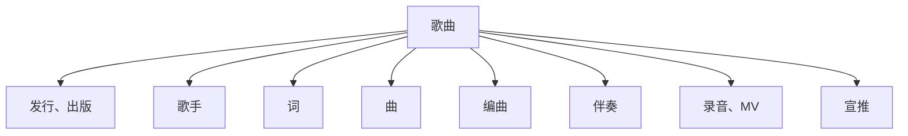

# 2025艺术法概论笔记

# 一

在课上以老师的身份要求一个同学离开教室，同学维护了自己的权利。

有趣的课堂要求：以小红书发帖的形式作为平时成绩。如有必要再协商。

自我介绍：
- 北大法律硕士，辗转两家公司，进入金杜事务所；后来考公务员成为了法官；香蕉娱乐。
- 考了很多证，认为最重要的是心理咨询师证。

自己的工作能被 AI 取代吗？

经纪人方向、制作人方向是不错的方向。

## 什么是艺术？

文学、雕塑、绘画、摄影、音乐、舞蹈、戏剧、影视、装置艺术……

### 1. 作品

所有这些内容，在法律框架内，即著作权法内，都属于 **“作品”** 。

需要一个客观标准和定义，使之成为 **“作品”** 。

### 2. 作者

艺术的诞生离不开 **“作者”** 。

这个作者可以是 **自然人** ，可以是 **法人** ，但不包括 **AI** 。

**AI** 是否可以被纳入作者的范畴？这是一个需要思考的问题。

目前，全世界范围的共识不认为 大模型提供商 是作者，即使 AI 被认定为作品，其作者也应是 输入指令的人 。

> 成文法体系下的三段论：
>   1. 法条：大前提，法律规则或法规，作为推理的基础。
>   2. 事实：小前提，案件的具体事实或情况，与法条相对应。
>   3. 结论：判决，通过将事实适用于法条而得出的法律结果或裁决。
> 
> 法律三段论需要在一个共同的法律框架内被理解和应用，以确保法条的解释和适用是一致的。
> 
> 这样就形成了“黑话”——这是法律共同体的衍生，减少歧义、增加效率，最重要的是构建统一的共识。

> **成文法与判例法**  
>   { Generated by GLM-4.5-AIRX | 智谱开放平台 }
>   
> **成文法体系** - 以系统编纂的**法典**（如民法典、刑法典）为主要法律渊源，强调法律的成文化和条文化，代表为**大陆法系**（如德国、法国）。法官主要依据成文条文进行逻辑推理，三段论是核心裁判方法。  
>   
> **判例法体系** - 以**司法判例**（先例）为主要法律渊源，遵循"遵循先例"原则，代表为**英美法系**（如英国、美国）。法官通过归纳过往案例形成法律规则，裁判更注重个案分析和类比推理。  


## 一些定义

### 1. 著作权法

```
著作权 = 版权
```

```
IP = 知识产权
```

**著作权法** 是知识产权体系的一个小分类。

除此之外，知识产权还包括：**商标法**、**专利法**、**域名法**……

本课仅涉及知识产权法下的一个小角落——著作权法，而涉及的作品仅提到 **音乐** 。

### 2. 音乐作品

一首歌曲的构成，包括什么环节？



### 3. 肖像、名誉——人格权

### 4. 解约、账号（利益）——合同

### 5. 本课所指的艺术法是什么？

法商结合，行业法，从业规则。
