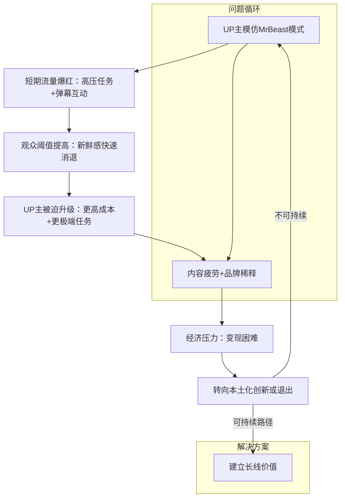

# [中国UP主成为不了MrBeast](https://mp.weixin.qq.com/s/7f346kH7VzOfelJHGUCzSg)

> 公众号/壹娱观察  文/大娱乐家

### 目录

- ​**​事件概述​**​：描述核心事件和数据。
- ​**​模仿MrBeast的现象与吸引力​**​：分析为什么UP主模仿MrBeast模式。
- ​**​短期成功与潜在问题​**​：探讨爆红背后的逻辑和风险。
- ​**​长期困境与生态差异​**​：对比国内外环境，讨论可持续性挑战。
- ​**​经济压力与变现难题​**​：分析成本投入和回报问题。
- ​**​结论与建议​**​：总结核心观点，提出本土化创新方向。
- ​**​核心逻辑流程图​**​：用Mermaid图表总结整体思路。

---

### 事件概述

“100小时荒岛直播挑战”是由影视飓风创始人Tim主导的一次B站直播活动，在2023年夏天成为现象级事件。直播中，Tim在荒岛环境中完成高压任务，通过沉浸式体验吸引观众参与。数据显示，B站累计观众超过4000万，全平台总观看量突破2亿，弹幕数量达百万级，并带动了直播带货的即时转化。事件登上热搜，被评价为“爆款”逻辑的完美演绎。然而，质疑声随之而来：直播被批评为“带电度假”而非真实生存挑战，且形式与全球视频流量之王MrBeast的内容高度相似，引发“影视飓风野兽先生化”的讨论。这反映了国内内容生态的模仿趋势，但问题在于模仿虽能带来短期流量，却难以复制MrBeast的长期成功，尤其是在高度内卷的国内市场环境下。

---

### 模仿MrBeast的现象与吸引力

国内UP主模仿MrBeast已成为常见路径，具体表现为挑战类视频、撒钱式奖励、极端任务设定、快节奏剪辑和相似封面设计。这种模仿的吸引力在于流量逻辑主导的时代，一个已验证的叙事公式被视为捷径。影视飓风的荒岛挑战之所以迅速引爆话题，是因为它紧贴MrBeast公式：在极端环境下设置高压任务（如100小时生存），结合沉浸式长时直播和弹幕互动，创造出强烈的“在场感”。算法的推荐机制进一步放大内容扩散，实现跨圈层突破。例如，MrBeast的视频如“障碍赛挑战”通过撒钱和极限实验吸引全球观众，而国内UP主如影视飓风通过类似设计（如荒岛直播）获得即时流量。然而，这种模式的核心问题是易复制性——一旦套路被识破，观众新鲜感会快速消退，导致UP主陷入“军备竞赛”，即通过更高成本、更极端任务来维持热度，而非依靠自身独特性。

---

### 短期成功与潜在问题

挑战类视频的短期爆红依赖于不断制造刺激以满足观众猎奇心理。影视飓风的直播成功证明了该模式的传播力：高压任务（如荒岛生存）和即时参与感（弹幕互动）形成强吸引力，算法助推下实现数据亮眼。但问题在于可持续性缺失。首先，观众阈值会快速抬升——新鲜感和刺激感来得快、走得也快，导致内容疲劳。例如，游戏博主贪玩歌姬小宁子的视频《2元vs万元电池，谁更容易爆炸？》虽模仿MrBeast极限实验获得关注，但观众弹幕如“逐渐野兽化”显示套路重复，新鲜感下降。其次，UP主被迫追求更高成本（如更极端设定），甚至冒险突破安全边界（如小宁子视频中不戴护目镜钻电池），以换取轰动效果。这稀释了创作者品牌，因为流量峰值由外部刺激驱动，而非内在独特性。最终，模仿规模扩大加速行业疲劳——观众不再满足于单纯撒钱或极端情境，转而期待更复杂故事和深度内容表达。

---

### 长期困境与生态差异

国内UP主难以成为MrBeast的根本原因在于内容生态土壤不同。MrBeast的成功依赖YouTube的全球市场（4亿国际受众）和广告分成机制，能通过高播放量（单期视频上亿）摊平成本。例如，他的“现实版《鱿鱼游戏》视频”跨越文化隔阂，以直白方式制造共鸣。但在中国，UP主面临有限市场天花板、严格审查约束和激烈平台竞争。影视飓风虽已是B站千万级UP主，仍需额外频道（如飓多多StormCrew）吸引流量，显示回报不对称。此外，过度模仿侵蚀差异化优势：影视飓风原以高水准影像制作见长，何同学擅长知识叙事，小宁子专注游戏测评，这些特质是建立长线价值的关键。但裹挟到“极限挑战＋撒钱”模式中，UP主放弃深层连接内容，观众长期停留依赖辨识度而非短暂刺激。本土环境错位也加剧困境——政策、尺度和社会价值观限制“极端挑战”的边界（如“撒钱”视频易引发炫富质疑），而MrBeast在B站已有500万粉丝，模仿者难以超越。

---

### 经济压力与变现难题

持续高投入的经济压力是模仿模式的核心门槛。MrBeast通过广告分成和品牌合作回收成本（如全球流量支撑），但国内创作者变现渠道有限。影视飓风主要收入来自自营服装品牌，视频流量无法完全支撑公司运营。一旦挑战类内容无法转化为稳定收入，UP主难以为继高投入。过往案例显示，整活儿类UP主在爆红后常陷入产能焦虑：要么转向低成本内容（如简化任务），要么中断更新。热度消退速度快于预期，Tim的直播虽证明模式可行，但揭示其局限——单次出圈不代表长期出路。经济压力迫使UP主在“军备竞赛”中消耗资源，却无法保证可持续回报。

---

### 结论与建议

模仿MrBeast能带来短期流量，但不可持续：它导致观众疲劳、品牌稀释、经济压力，并忽视本土生态差异（如市场限制和审查）。影视飓风的“100小时荒岛直播挑战”是一次成功试验，但凸显了模式的瓶颈——爆红不等于长红。建议国内UP主在借鉴基础上寻找本土化创新：将挑战形式与独特叙事结合（如融合知识测评或社会议题），而非盲目复制。MrBeast可作为灵感，但答案在于差异化内容（如影视飓风的影像技术或何同学的知识深度），以建立长期观众连接。核心是避免“财富密码”陷阱，转向可持续创作。

---

### 核心逻辑流程图

模仿引发短期成功，但观众疲劳和经济压力形成负循环；
突破点在于转向本土化创新，强调独特性和深度内容。